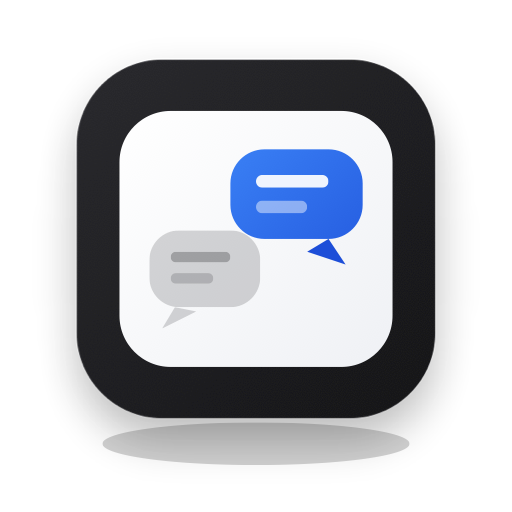

  

<h1 align="center">Lulu Dialogue Skills</h1>

<b>On-demand dialogue modes. You name the move. The reply changes how the conversation runs.</b>

  

---

An [Agent Skills](https://agentskills.io) pack for conversation. It owns how this stretch of talk proceeds. It does not own delivery, and it does not persist unless you ask.

| Key | What it does |
|---|---|
| `/plain` | Say it so a first-time inheritor can follow |
| `/gist` | Bottom line first |
| `/explain` | Smallest explanation of one object, then stop |
| `/ground` | Pin a vague reply to inspectable implementation evidence |
| `/walk` | Walk a confirmed node list, one node per turn |
| `/grill` | Pursue one Goal with focused questions |
| `/clash` | Press your expectation against the status quo |
| `/converge` | Lock a disposition queue, one question at a time |
| `/cut` | Change the working boundary first |

## Use

Name a key in chat, or say the matching intent — for example `plain language`, `ground this`, `cut once`, `grill this`.
